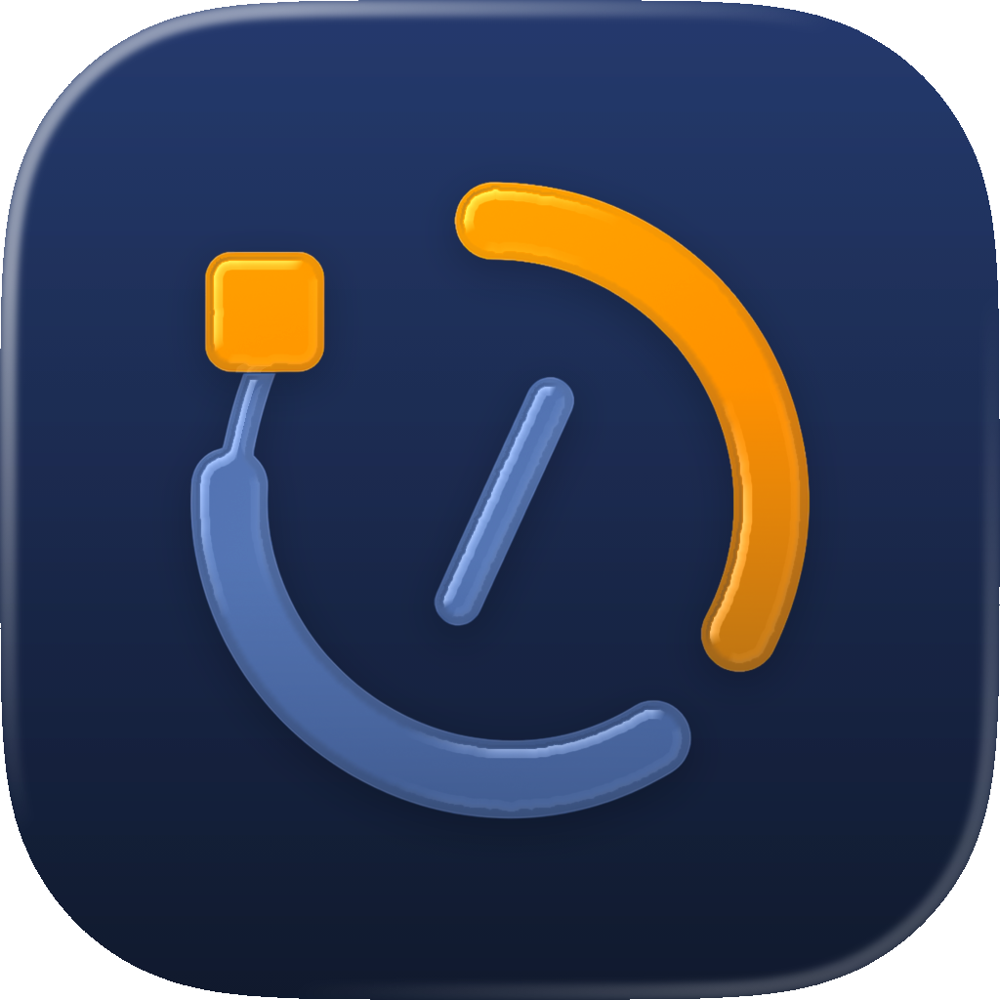

<div align="center">


# Codex Limit Widget

English / [简体中文](README-CN.md)

[](https://github.com/MiaowCham/Codex_Limit_Widget/blob/main/LICENSE)
[](https://github.com/search?q=repo%3AMiaowCham%2FCodex_Limit_Widget++language%3AC%23&type=code)
[](https://github.com/MiaowCham/Codex_Limit_Widget/releases)
[](https://github.com/MiaowCham/Codex_Limit_Widget/actions/workflows/build.yml)
[](https://github.com/MiaowCham/Codex_Limit_Widget/commits/main)

A lightweight cross-platform desktop widget for viewing Codex usage and reset times.

</div>

> [!NOTE]
> This project is Powered by Codex

## Features

- Shows primary and weekly limits, reset times, credits, and the current plan
- Supports scheduled and manual refreshes
- Supports window dragging and always-on-top toggling
- Provides a system-tray menu to show or hide the window, toggle always-on-top, refresh, open the project page, and exit
- Provides `status` and `watch` CLI modes
- Builds and tests on Windows, Linux, and macOS

## Requirements

The cross-platform desktop app uses Avalonia 12. Production builds use .NET 10; the App, CLI, Core, and test projects fall back to `net8.0` with older SDKs.

The app reads usage limits through `codex app-server`, so it requires:

- Codex CLI installed
- The `codex` command available on `PATH`
- A signed-in Codex CLI session

IDE extensions do not usually include a standalone Codex CLI. Install it separately when needed.

## Usage

### Install a release build

Download an installer or build artifact from [Releases](https://github.com/MiaowCham/Codex_Limit_Widget/releases) or GitHub Actions:

- Windows x64 Slim installer: smaller framework-dependent package; requires .NET 10 x64 Runtime
- Windows x64 Full installer: self-contained package; no separate .NET installation required
- Linux x64: self-contained executable and DEB package
- macOS: ad-hoc-signed `.app` bundles for Apple Silicon and Intel

The macOS artifacts are not signed with an Apple Developer ID or notarized. You may need to allow the app manually in system settings on first launch.

### Start the desktop widget

```powershell
dotnet run --project CodexLimitWidget.App -- --interval 60
```

`--interval` is in seconds, accepts `1` through `86400`, and defaults to `60`.

The display language follows the system by default. Override it for a launch with `--language`, for example:

```powershell
dotnet run --project CodexLimitWidget.App -- --language JP
```

Supported translations are English, Simplified Chinese, Traditional Chinese, and Japanese. Unsupported cultures fall back to English.

### Query once

```powershell
dotnet run --project CodexLimitWidget.Cli -- status --language en-US
```

### Watch continuously

```powershell
dotnet run --project CodexLimitWidget.Cli -- watch --interval 60 --language zh-Hant
```

Press `Ctrl+C` to stop watching.

## Build from source

Install the [.NET 10 SDK](https://dotnet.microsoft.com/download/dotnet/10.0), then run:

```powershell
dotnet build CodexLimitWidget.slnx -c Release
dotnet test CodexLimitWidget.slnx -c Release --no-build
```

### Windows x64

Create a self-contained single-file app:

```powershell
dotnet publish CodexLimitWidget.App/CodexLimitWidget.App.csproj `
  -c Release -r win-x64 --self-contained true `
  -p:PublishSingleFile=true -o publish/win-x64/app
```

To choose interactively between the Slim, Full, or both Windows installers, install Inno Setup 6 and run:

```powershell
./installer/build.ps1
```

For a non-interactive build of both installers:

```powershell
./installer/build.ps1 -Package Both -Version 1.0.0
```

Use `-Package Slim`, `-Package Full`, or `-Package Both`. Slim is framework-dependent and smaller; Full is self-contained and does not require a separately installed .NET runtime.

Version inputs accept `x.y.z`, `x.y.z.w`, and either form with an alphanumeric suffix such as `1.2.3-preview` or `1.2.3.4-preview`. The complete input is stored as `InformationalVersion`; Assembly/File and installer resource versions use the numeric part before `-`, with `.0` appended to three-part versions. CI builds append another `-` plus the seven-character commit hash to `InformationalVersion` only. .NET exposes the informational value as the Windows PE `ProductVersion`; the strictly numeric values remain available as Assembly/File versions and the installer `VersionInfoVersion`.

The script downloads the official Simplified Chinese, Traditional Chinese, and Japanese Inno Setup translations. The installer also includes English.

The two installers are alternative installation media for the same application and share one installation directory and uninstall entry. Installing one replaces the other:

- `CodexLimitWidget-<version>-Windows-x64-Slim-Setup.exe` is smaller and requires the matching .NET x64 Runtime.
- `CodexLimitWidget-<version>-Windows-x64-Full-Setup.exe` includes the runtime and works without a separate .NET installation.

### Linux

The interactive script supports x64/ARM64, .NET 10/.NET 8, self-contained binaries, and DEB packages:

```bash
bash installer/build-linux.sh
```

Building a DEB also requires `dpkg-deb`.

### macOS

The interactive script supports Apple Silicon/Intel, .NET 10/.NET 8, and can create an `.app` and ZIP:

```bash
bash installer/build-macos.sh
```

.NET 10 is the default target; the script also provides a .NET 8 compatibility build. The application bundle does not declare a minimum macOS version in `Info.plist`; building requires `CodexLimitWidget.icns` in the repository root and the system `codesign` command. Apple's bundle version fields remain three-part numeric values, while the full informational version is stored in `CFBundleGetInfoString` and `CodexInformationalVersion`.

## Logs

- Windows: `%LOCALAPPDATA%\CodexLimitWidget\Logs\widget.log`
- Linux: `$XDG_STATE_HOME/CodexLimitWidget/Logs/widget.log`
- Linux without `XDG_STATE_HOME`: `~/.local/state/CodexLimitWidget/Logs/widget.log`
- macOS: `~/Library/Logs/CodexLimitWidget/widget.log`

## CI and releases

GitHub Actions performs Release builds and tests on Windows, Ubuntu, and macOS. A `v*` tag or a manually triggered workflow also creates:

- Windows x64 Slim and Full installers
- Linux x64 self-contained binary and DEB package
- macOS Apple Silicon and Intel `.app` bundles

## License

This project is licensed under the [Apache License 2.0](LICENSE).
